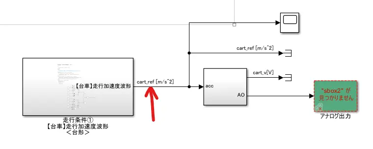
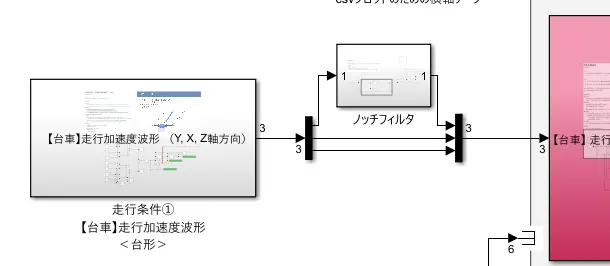
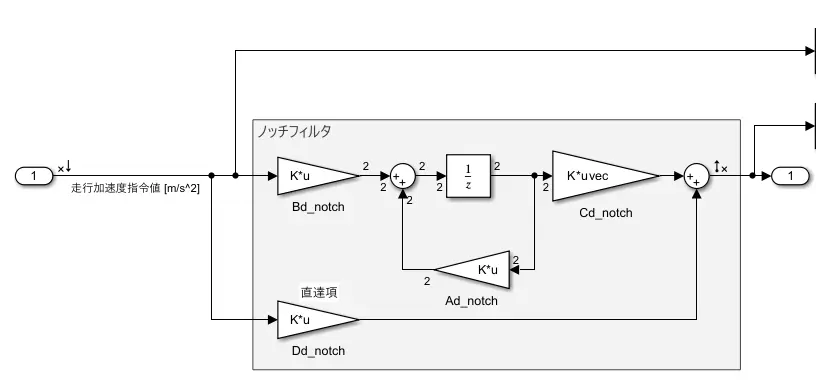
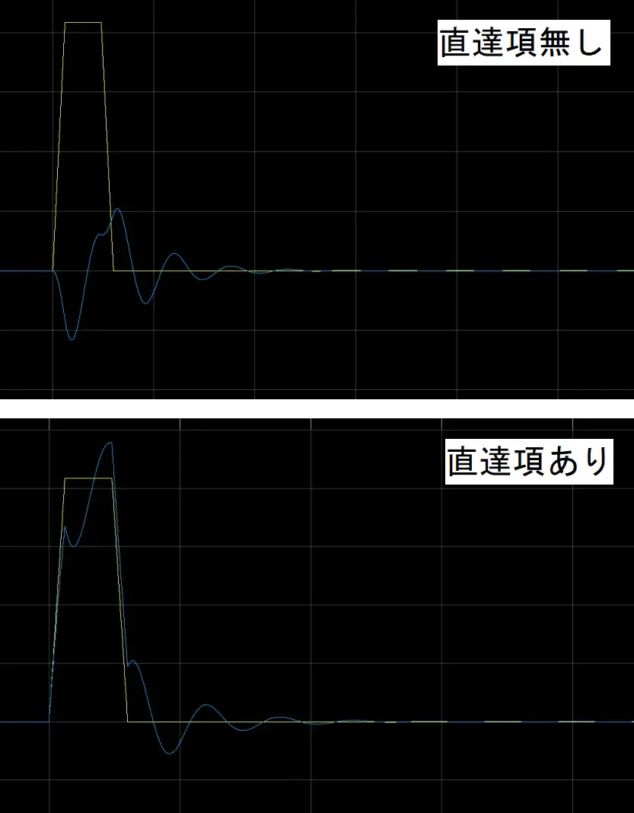
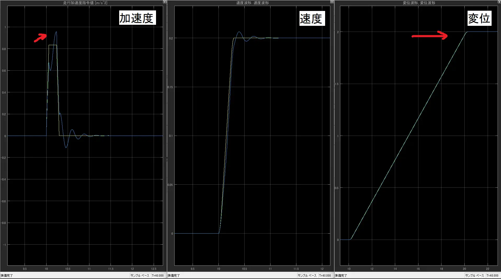
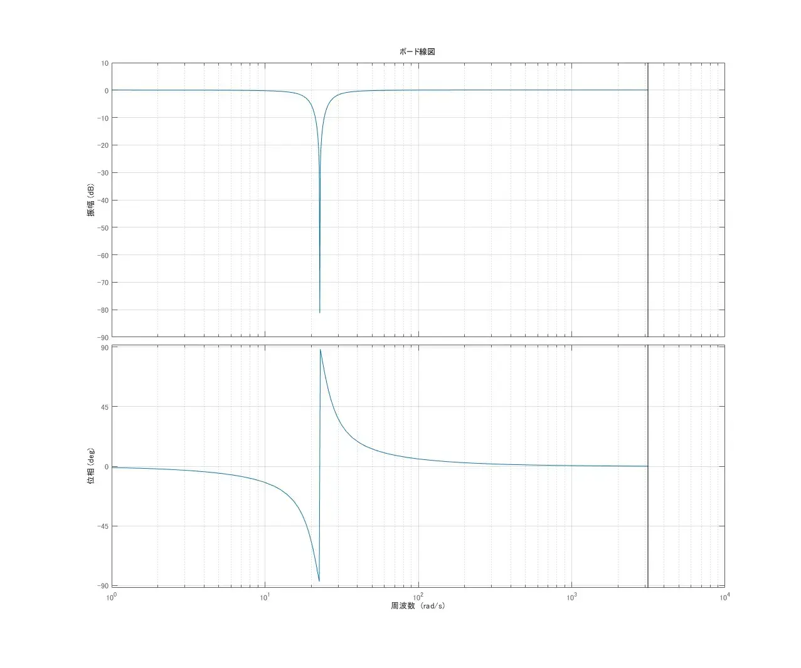

# ノッチフィルタ（Notch Filter）
> 特定の帯域の周波数成分をピンポイントで除去する帯域除去フィルタの一種．

伝達関数は（↓連続時間系）  

$$
G(s)=\frac{s^2+2\zeta_z\omega_ns+\omega_n^2}{s^2+2\zeta_p\omega_ns+\omega_n^2}
$$

- $\omega_n$ ：除去したい中心周波数
- $\zeta_z$ ：零点の減衰比
- $\zeta_p$ ：極の減衰比  

$\zeta_z < \zeta_p$ とすることで中心周波数付近のゲインが深く落ちる「ノッチ（切り欠き）」形状の周波数特性が得られる．  
2つの減衰比は，既にあるシステムの零点や極ではなく，自分が今から設定するノッチフィルタの零点や極のこと．  

注意点  
制御工学ではノッチフィルタ適用により「低周波側に位相遅れ」が生じるため，安定性が損なわれないか（位相余裕・ゲイン余裕）をボード線図やナイキスト線図で確認する必要がある．  
★特に，制御器 $C(s)$ の帯域幅が，ノッチ周波数に近いとき，この影響が顕著になってしまう...  
- 低周波側：わずかな位相遅れ→安定余裕の低下
- 高周波側：ほぼ影響なし

入力整形法との違い
- 入力整形法：FFによる指令整形
- ノッチフィルタ：FBループ内に挿入する形で用いられる
	- 「コントローラ」→「ノッチフィルタ」→「プラント」　ここに挿入するのが普通

応用例
- 電源ハム音（50/60 Hz）除去
- 機械共振周波数の制振制御
- 音響ノイズキャンセリング
---
## 実装してみる
パターンは2つ挙げられる
- ループ内に組み込む
	- 「コントローラ」→「ノッチフィルタ」→「プラント」 と挿入
	- （仮にLQRなど最適制御なら，最適性を崩さないようにきちんと評価関数に組み込む）
- ループ外に組み込む
	- 「走行加速度指令値」→「ノッチフィルタ」→...
	- 今回はこっちで実装してみる
### どこに挿入するか
- 指令値のすぐ後





### MATLABコード
- サンプリング周波数： $T_s = 0.001$ 秒
- ひとまず3つのパラメータを次のように決定
	- $\omega_n = 3.63×2×\pi$ 
	- $\zeta_z = 0.0$ 
	- $\zeta_p = 0.2$ 

```
% ------------------------------------------------------------
% 260626_1754
% ノッチフィルタ
% ------------------------------------------------------------
% パラメータ
fc_notch  = 3.63;              % 中心周波数[Hz]←除去したい周波数
wn_notch  = 2 * pi * fc_notch; % [rad/s]
zeta_z    = 0.0;               % 零点の減衰比 とりあえず理想値として0
zeta_p    = 0.2;               % 極の減衰比 暫定

% 連続系の伝達関数
num_notch_c = [1, 2 * zeta_z * wn_notch, wn_notch^2]; % 分子
den_notch_c = [1, 2 * zeta_p * wn_notch, wn_notch^2]; % 分母

% 伝達関数 → 状態空間
[An, Bn, Cn, Dn] = tf2ss(num_notch_c, den_notch_c);
sys_notch = ss(An, Bn, Cn, Dn);

% 離散系に変換 c2d()
sysd_notch = c2d(sys_notch, Ts);

% 離散系のシステム行列を変数に取り出す
Ad_notch = sysd_notch.a; % →Simulink
Bd_notch = sysd_notch.b; % →Simulink
Cd_notch = sysd_notch.c; % →Simulink
Dd_notch = sysd_notch.d; % →Simulink
```

### 離散モデルでのブロックのつなぎ方
- mファイル側で定義した A, B, C, Dd_notch をこのようにつなげる．



- 直達項が必要だった↓



### 結果
- 加速度は元々綺麗な台形波形．
- 凡例の色
	- 黄色：元の波形
	- 青色：ノッチフィルタ適用後
- 全ての波形は少し(位相)遅れが生じた
- 加速度波形と速度波形は
	- 振動的になった　←3.63Hz=0.28秒の周期で振動
	- オーバーシュートが発生　←難点
- 変位波形は
	- 最終値が同じ　←ノッチフィルタのDCゲインが1であるから



- ノッチフィルタの周波数特性（ボード線図）



