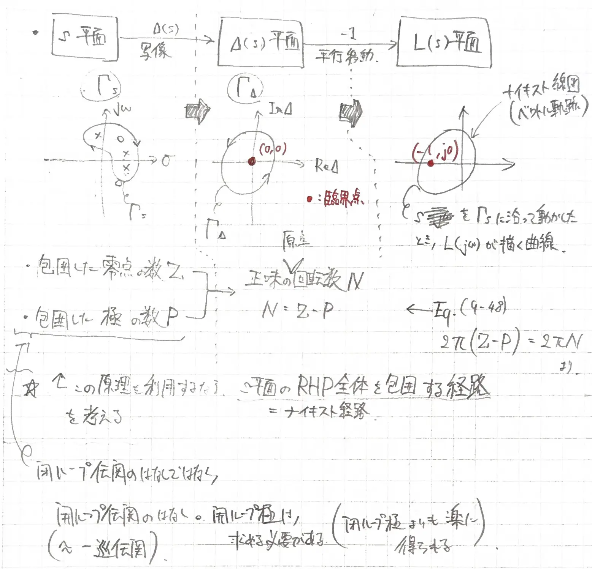
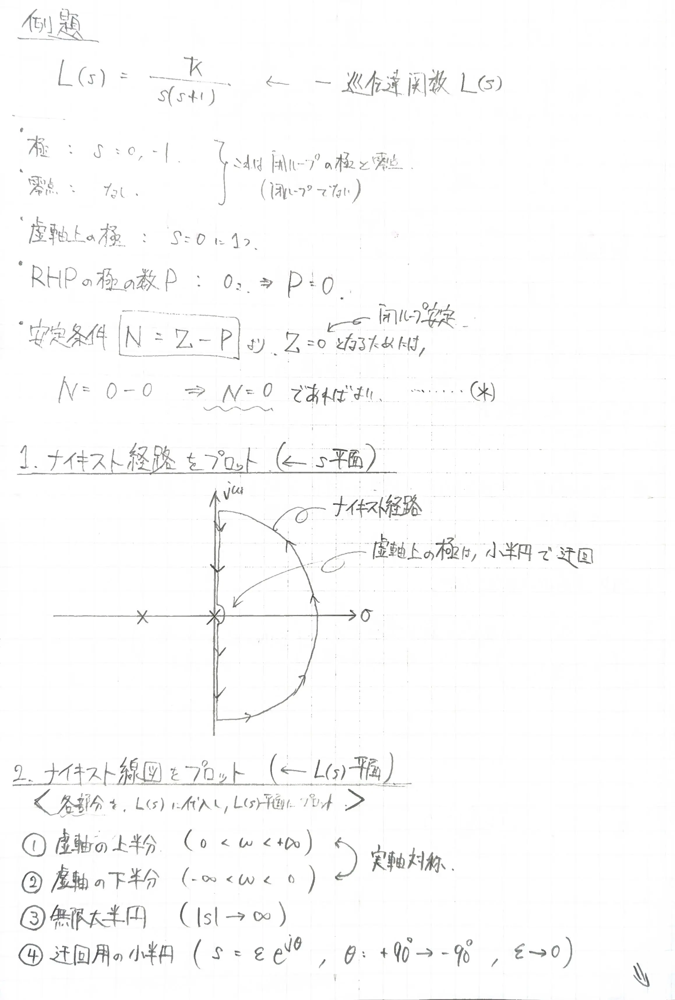
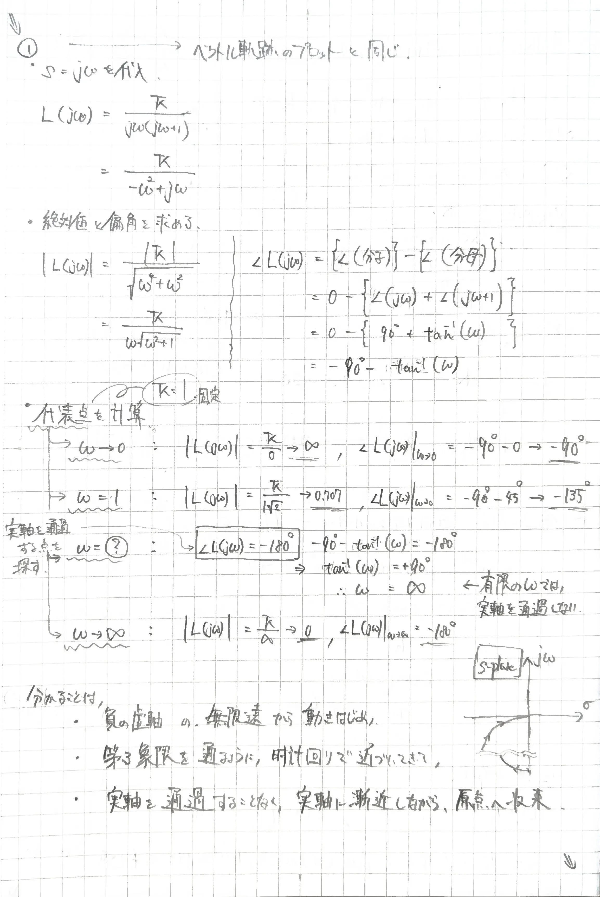
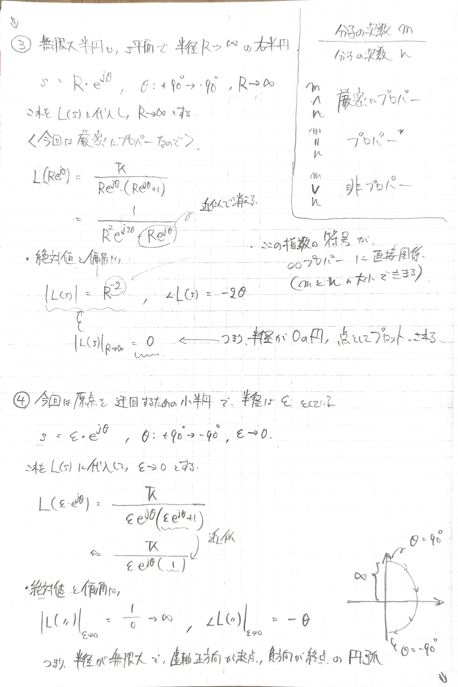
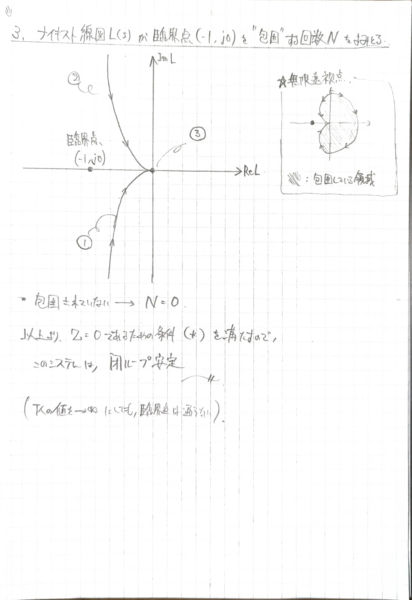

# ナイキストの安定判別法（Nyquist Stability Criterion）
> フィードバック制御系の閉ループ安定性を，一巡伝達関数 $L(s)$ のナイキスト線図と臨界点 $(−1, j0)$ の周回数から図式的に判別する手法．

- 最終的に知りたいこと：閉ループ安定性（閉ループが安定かどうか??）
- ↑言い換えると，特性方程式 $1 + L(s) = 0$ の根(閉ループ極)が$s$平面の右半面(RHP)にあるかどうか
- 閉ループ極を直接解くのは面倒なので，開ループ伝達関数$L(s)$ のプロットを見るだけで判定するのがナイキスト安定法

## 1. 文字・用語の設定
**＜必須級＞**
- $L(s)$：一巡伝達関数
- $\Delta(s)$：一巡伝達関数の特性方程式「 $L(s) + 1 = 0$ 」の左辺部分．$\Delta(s) = L(s) + 1$
- $s$平面：よくみるガウス平面．ここにナイキスト経路 $\Gamma_s$ を設定する
- $\Delta(s)$平面：$s$平面の写像先?となる平面　←原点に臨界点をもつ
- $L(s)$平面：$\Delta(s) = L(s) + 1$ より平行移動した平面　←$(-1, j0)$ に臨界点をもつ
- $\Gamma_s$：ナイキスト経路．$s$平面のRHP全体を覆う閉曲線
- $\Gamma_\Delta$：ナイキスト経路を$\Delta(s)$平面に写像してできた閉曲線
- ■：ナイキスト線図．$s$ を $\Gamma_s$ に沿って動かしたとき $L(j\omega)$ が描く曲線
- 包囲：閉曲線が任意の点を閉じ込めたときの呼び方．閉曲線に向きがあるので符号付きで表記される
- 開ループ極：開ループ伝達関数($\approx$一巡伝達関数)の極
- $Z$：ナイキスト経路が"包囲"する開ループ零点の数　←閉ループ安定のためには $Z = 0$ が必要
- $P$：ナイキスト経路が"包囲"する開ループ極の数
- $N$：$\Gamma_\Delta$ が臨界点$(0, 0)$ を"包囲"する回数，あるいは，ナイキスト線図が臨界点$(-1, j0)$ を"包囲"する回数

**＜補足的＞**
- 一巡伝達関数（Loop Transfer Function, $L(s)$）
- 開ループ伝達関数（Open-Loop Transfer Function, $G(s)）
- 閉ループ伝達関数（Closed-Loop Transfer Function, $M(s)$）

$$
M(s) = \frac{G(s)}{1+G(s)H(s)} = \frac{G(s)}{1+L(s)}
$$

- 閉ループ特性方程式
　開ループ伝達関数の「分母=0」とする方程式  
　これを解くことで閉ループ極が得られる

$$
\begin{align}
1 + G(S)H(s) = 0 \\
1 + L(s) = 0 \\
\Delta(s) = 0
\end{align}
$$

- 右半平面（Right-Half s-Plane, RHP）

### 1.1 一巡伝達関数と開ループ伝達関数の違い
> 文献間で定義が異なる場合がある  
> 

### 1.2 なぜ3つも平面があるか??
> ナイキスト安定判別法の厳密な定義では 写像→平行移動 の2段階のプロットを経て，ナイキスト線図を得るため  
> ★実用上，中間の$\Delta(s)$平面は不要  
> ★さらに，システムが「最小位相系」であれば，ナイキスト線図も一部だけで足りる

#### ナイキスト経路→ナイキスト線図の流れ
- 【$s$平面】の $\Gamma_s$
	- ↓写像
- 【$\Delta(s)$平面】の $\Gamma_\Delta$ 
	- ↓平行移動（ $\Delta(s) = L(s) + 1$ ）
- 【$L(s)$平面】の ナイキスト線図

写像をとることで，$s$平面における全ての極を，$\Delta(s)$平面の原点という一点にもってくることができる．  
→これを臨界点と定義する  
平行移動は，単に $\Delta(s) = L(s) + 1$ と定義しているので，「開ループ伝達関数$L(s)$ の軌跡が欲しいなら平行移動すればok」ということ．

### 1.3 包囲

### 1.4 公式 $N = Z - P$
- $P$ ：開ループ極
	- $L(s) = G(s)H(s)$ の極のうち，RHPにあるもの．
	- フィードバックをかける前の開いたループの不安定さ
- $Z$ ：閉ループ極
	- $1 + L(s) = 0$ の根のうち，RHPにあるもの．
	- フィードバックをかけた後の，実用上の閉ループ系の不安定さ
- 安定性を決めるのは $Z$ だけ
	- $P$ がどんな値でも，$Z = 0$ であればそのシステムは安定．
	- （不安定な開ループ系を，フィードバックで安定化する．という流れと同じで，普通の話）
- $N$ の値は，直接安定性には関係ない．
- 結局，流れとしては，まず$P$ が分かる．この$P$ に対してNがどんな値であれば～～　という考え方をする
	- 例）$P = 1$ で開ループが不安定なシステムを安定化させたいなら...
		- 大前提必要なのは $Z = 0$ 
		- ↑より，こうなるためには $N = 0 - 1$ で，$N = -1$ であれば良い!!!
		- すなわち，$L(s)$線図が臨界点 $(-1, j0)$ を反時計回り(CCW)に1回「囲い込み」すればよい．
### 1.5 $s$平面の$\Gamma_s$ と $\Delta(s)$平面の$\Gamma_\Delta$ 軌跡の向き
2つの平面の軌跡の向きは，$N$の符号で決まる  
- $N > 0$：$\Gamma_s$ と $\Gamma_\Delta$ は同じ向き
- $N < 0$：$\Gamma_s$ と $\Gamma_\Delta$ は反対向き
- $N = 0$：包囲無し
理由は，$N = Z - P$ の式と，$Z$ と $P$ の性質による．  
- $Z$：
	- $s$平面において $\Gamma_s$ が包囲する開ループ「[極]」の数で，
	- $\Delta(s)$平面では 原点を $\Gamma_s$ と[反対]向きに包囲する
- $P$：
	- $s$平面において $\Gamma_s$ が包囲する開ループ「[零点]」の数で，
	- $\Delta(s)$平面では 原点を $\Gamma_s$ と[同じ]向きに包囲する
- つまり，$N > 0$ となるのは $P$ の方が大きいことを意味し，
	- 原点を反対向きに回る回数よりも同じ向きに回る回数の方が多かったという事
- 反対に，$N < 0$ となるのは $Z$ の方が大きいことを意味し，
	- 原点を同じ向きに回る回数よりも反対向きに回る回数の方が多かったという事

## 2. 判定手順
1. ナイキスト経路を $s$平面にプロット
	- 開ループ極を求める
	- 開ループ零点を求める
	- 虚軸上の極を求める
	- RHPの極の数 $P$ をカウントする
		- この段階で，安定条件の公式 $N = Z - P$ と，目当ての「閉ループ安定」の条件 $Z = 0$ から，所望の $N$ の値が分かる．
2. ナイキスト線図を $L(s)$平面にプロット（ゲインは $K = 1$ に仮置き）
	- ①虚軸の上半分 $(0 < \omega < + \infty)$　←これはベクトル軌跡そのもの
	- ②虚軸の下半分 $(- \infty < \omega < 0)$　←これは①の実軸対象
	- ③無限大半円 $(s = R e ^{j\theta}, \theta: +90 → -90, R → \infty)$ あるいは $(|s| → \infty)$　←厳密にプロパーのとき原点の「点」となる
	- ④迂回用の小半円 $(s = \epsilon e ^{j\theta}, \theta: +90 → -90, \epsilon → 0)$　←無限大半円となる
3. ナイキスト線図が臨界点$(-1, j0)$ を"包囲"する回数 $N$ を読み取る
	- ①+②+③+④がそのままナイキスト線図となり，組み合わせることで **閉曲線** となる
	- 臨界点を包囲する回数 $N$ が，所望の値
		- であれば，「閉ループ安定」となる
		- なければ，「閉ループ安定」でない

## 3. 例題
一巡伝達関数 $L(s)$ が次式で与えられる一般的なシステムに対して，「閉ループ安定性」を判別する．  
一巡伝達関数は閉ループ部分も含めた入出力比のこと．  
ナイキスト安定判別法では，「閉ループ極」の位置を特定せずに安定判別することができる．（画像1枚目冒頭で求めている極と零点は，開ループ極であって閉ループ極ではない．）

$$
L(s) = \frac{K}{s(s+1)}
$$

