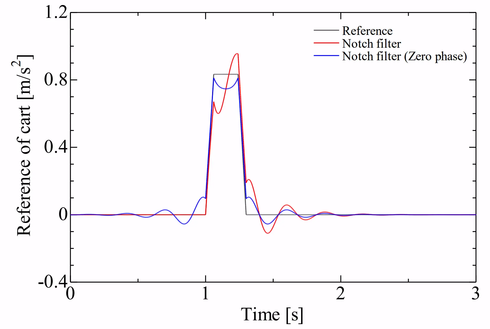
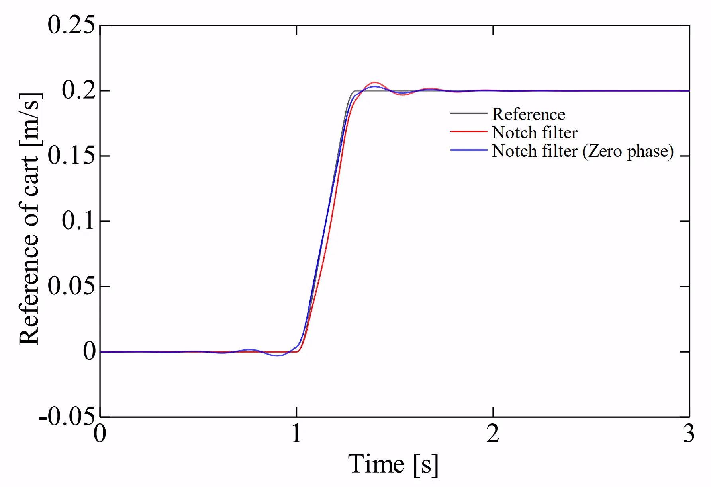

# 零位相フィルタリング（Zero-Phase Filtering）
> 信号を順方向・逆方向の2回フィルタリングすることで，位相歪みを相殺しゼロにするオフラインのフィルタ処理手法．

零位相フィルタリングでは，信号を  
- 順方向にフィルタ処理
- 時間を反転し，逆方向からフィルタ処理  
の2段階で行う．  
★時間を反転しており，未来の値から過去の値を決めているため，非因果的．
## 特性
### 位相特性
- 全周波数でゼロとなる（位相歪みが無い）
- 順方向で生じた位相遅れが，逆方向の処理で丁度相殺されるため
### ゲイン特性
- 元のフィルタの2乗 $|H(z)|^2$ になる
- 1回のフィルタリングより急峻な減衰特性が得られる
## 実装
### 制約・短所
- 信号全体を「数値の配列」として事前に取得しておく必要がある
- リアルタイム制御には使用できない
- プリリンギングが発生する　←この点では因果フィルタの方が良い
## MATLAB関数
- `filtfilt()`関数

### 実装例
> ノッチフィルタを零位相フィルタリングとして実装し，台形波形に適用した．  
> 灰色：元の台形波形  
> 赤色：ノッチフィルタ適用後（因果フィルタの場合）  
> 青色：ノッチフィルタ適用後（零位相フィルタリングの場合）  

適用するノッチフィルタのパラメータは，$f_{c \ notch} = 3.63,\; \zeta_z = 0.0,\; \zeta_p = 0.2$ とした．  

画像1, 2枚目：加速度，速度波形  

### ＜加速度波形＞  
- ノッチフィルタ（赤）では，オーバーシュートで最大加速度が大きくなり，なめらかでない（台車への負担?）
- ノッチフィルタ（青）では，プリリンギングが発生し，慣性センサの零点補正の邪魔になる．

### ＜速度波形＞  
- ノッチフィルタ（赤）では，動き出し前まで速度が 0 だが，位相遅れが目立つ．
- ノッチフィルタ（青）では，位相遅れは相殺されているが，走行開始時刻の前に動き出してしまう．

